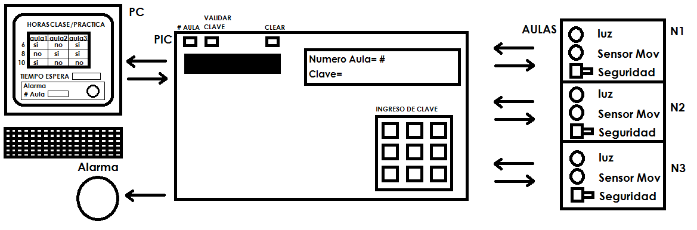

# Automatización de aulas audiovisuales

# Diagrama

# Explicación

## Trabajo de la PIC
Comunicarse con el PC constantemente comprobando el horario de las aulas en las que serán utilizadas, además de modificar el horario si el aula es abierta con un código de acceso por medio del teclado conectado a la PIC, el cuál requiere de un botón para seleccionar el aula y un botón de validación tanto del aula como de la clave. 
Si se detecta movimiento en el aula, sin que esta este reservada o haya sido abierta por el código de acceso, se encenderá una alarma física.
-	Controla las luces de las aulas
-	Controla la seguridad de cada aula
-	Detecta Movimiento en cada aula
-	Encender Alarma por movimiento en aula con seguridad encendida

**Ejemplo:** La PIC está monitoreando constantemente 3 aulas con un sensor de movimiento en cada una, si el aula no fue reservada ni abierta con el código de acceso y se detecta movimiento, se dispara una alarma física y le comunicará al PC el aula respectiva. Si se desea ingresar a una aula que no fue reservada, se tiene un botón para seleccionar el aula y un teclado para ingresar el código de acceso, después de validado, se encienden las luces y se desconecta la seguridad de la aula respectiva, además de comunicar un cambio en el horario de esa aula.

## Trabajo del PC
Comunicarse con la PIC constantemente, se asigna un horario y este puede cambiar de forma manual por teclado. En la PC se tiene un tiempo de espera por si pasado este tiempo, la aula reservada esta cerrada y vacía, se apagan las luces y se activa la seguridad de la puerta. Cuando la PIC le comunica al PC que la alarma se activó se enciende una alarma en pantalla con el numero del aula correspondiente. El Código de acceso para abrir la aulas se configura en el PC.
-	Controlar Alarma en pantalla
-	Configurar el horario de reserva de las aulas
-	Asignar código de acceso a las aulas manualmente
-	Actualizar el horario según se abra una determinada aula con el código de acceso

**Ejemplo:** Se tiene un horario diario de tres aulas, con las horas asignadas en las que abran clases, también se ingresa un tiempo de espera deseado por el usuario, el cual controla un tiempo prudente de espera para cada aula, por si se cancela la clase sin anticipación. Se ingresa o se modifica un código de acceso para las aulas, por si desean utilizar un aula que está disponible y no fue reservada con anticipación. Se tiene un espacio donde se informará si la alarma es activada y el aula al que corresponde tal emergencia.

# Happy coding
Made with <3

